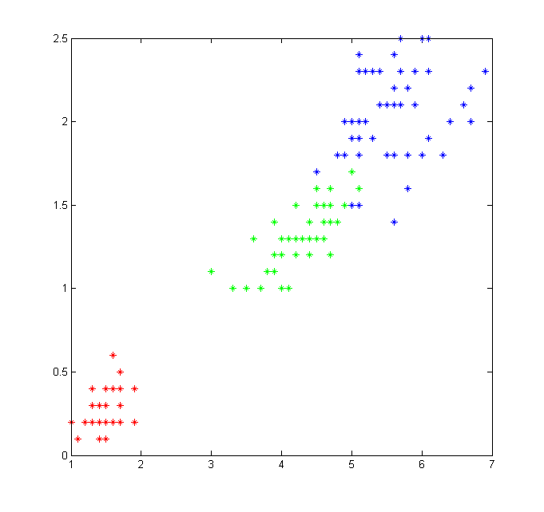
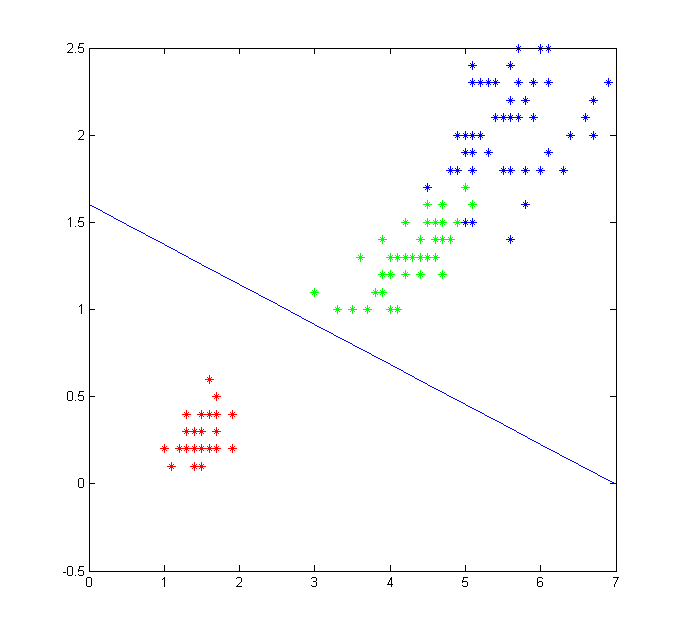
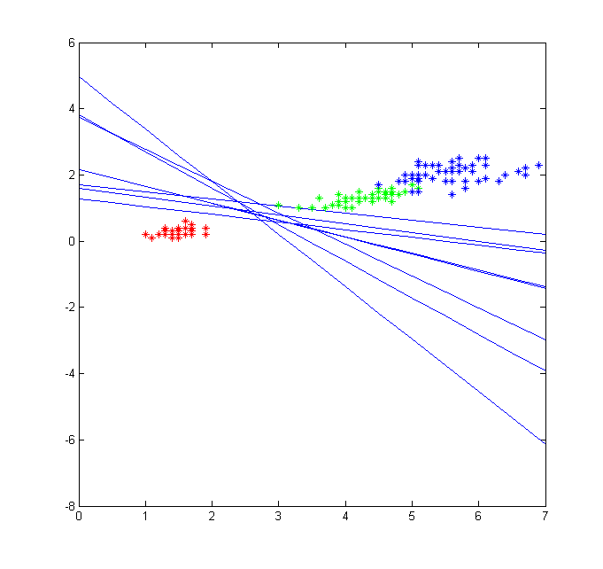
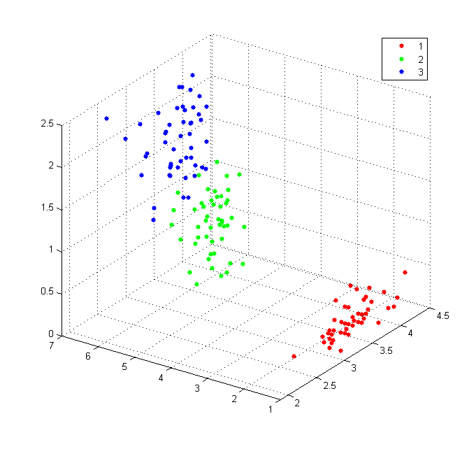
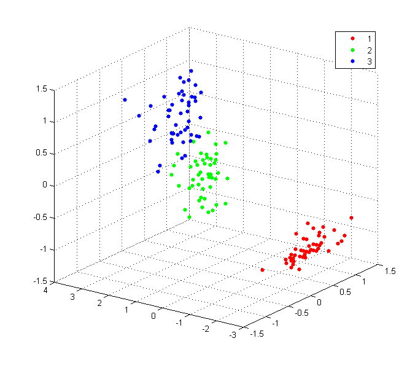
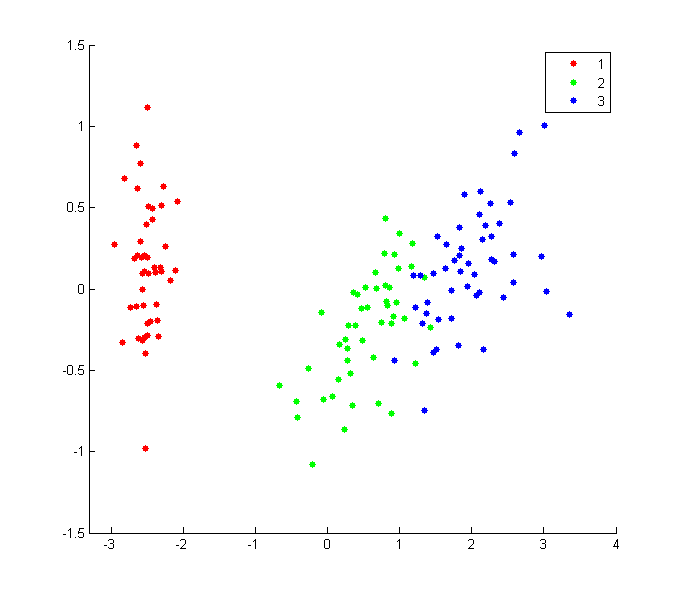
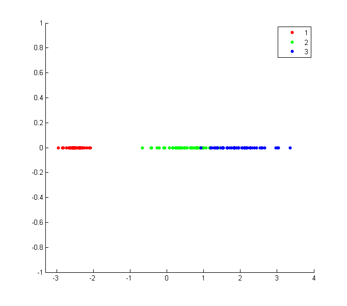

<h3> Perceptron </h3>

  <strong>Screenshots</strong> 
  <ul>
    <li> Visualização do espaço de características </li>
    
    <li> Obtenção de uma reta para classificação para um perceptron </li>
    
    <li> Outras possíveis retas obtidas para um perceptron </li>
    
  </ul>

<h3> PCA </h3>

  <strong>Screenshots</strong> 
  <ul>
    <li> Visualização do espaço de características </li>
    
    <li> Visualização do espaço de características ajustado </li>
    
    <li> Redução para 2 dimensões </li>
    
    <li> Redução para 1 dimensão </li>
    
  </ul>
  

